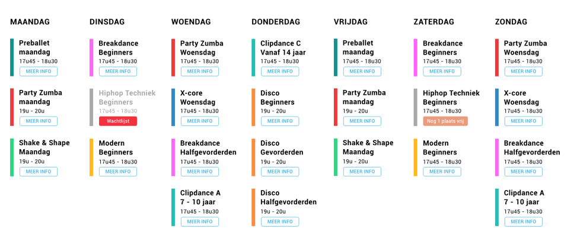

# Ledenbeheer calendar test
## How it should look like

## What we expect
A working example of the above calendar using the provided API and Vue application.
### Getting started
- To get started, use `docker-compose up` to start the Docker container (used to run the PHP application), this application should now be running on port 8000, visit `http://localhost:8000/calendar/events` to confirm
- Install the Vue app by accessing the `app` directory and executing `npm install`, confirm this by running `npm run serve` and check if your app starts. The command line should provide a URL where the app is hosted.
- Once all of this is working and you've read the entire README, add your name to `auth.json` file in the root of the project and create your first commit.

### API structure
- You have to care about two endpoints, there's `/calendar/events` and `/calendar/events/:id`, the `:id` is a wildcard being the ID of the calendar event, so for event ID 1 `/calendar/events/1`.
The detailed endpoint sends along the description while the list one does not.

### The Vue app
- This is a barebone Vue app with a Vue router created with the Vue CLI (Vue 3), `axios` is installed and configured already in `App.vue`, it is your task to make the calls to the events endpoint and render the events according to the provided design. 
When you click on `Meer info` button, it would be nice to show more details on the event (description) on another page.

The colors used next to the events are based on the category of the event, categories go from `1 to 5`, feel free to pick the colors for the IDs as you wish.

### Tips and ideas
- We are looking for clean and performant code, we really hate non DRY code!
- Since this is a frontend job, there are points for styling
- Use different components as needed
- Keep external packages to a minimum, but feel free to use them

## Send in your work
After one hour send in your work, if its not done yet commit all of your code now and execute the following steps:

Make a last commit with all your work, make sure to include FINAL as a verb so we know
Push the repo to your remote Git repo of choice, just make sure it is publically available
Send in the link of your repository to info@ledenbeheer.be

If you wish to continue after time, feel free to do so.

## Have any questions?
Ask along, we won't bite!